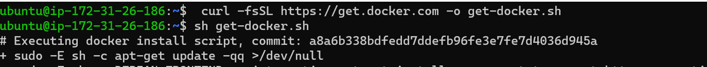
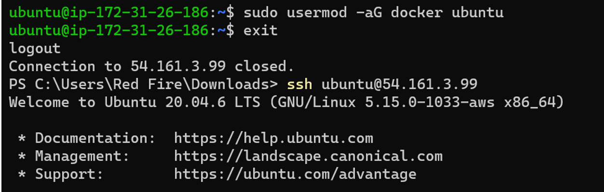
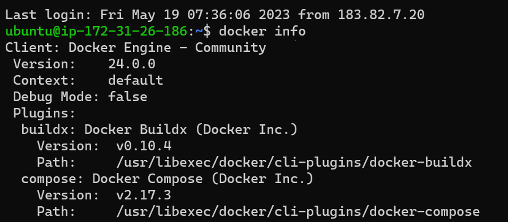
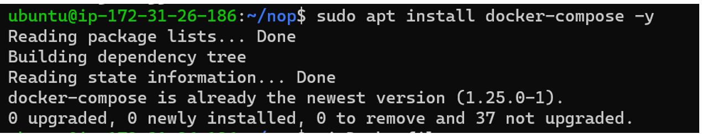
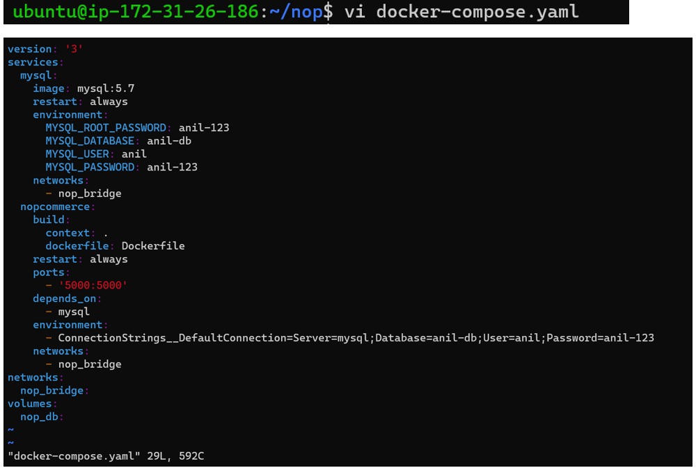
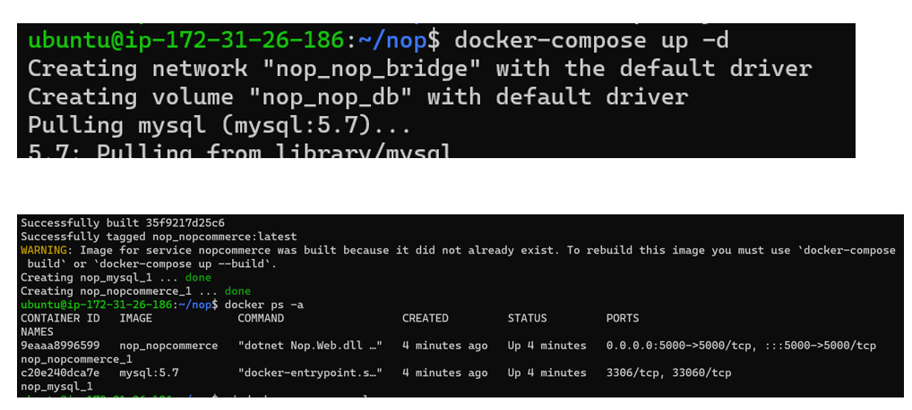
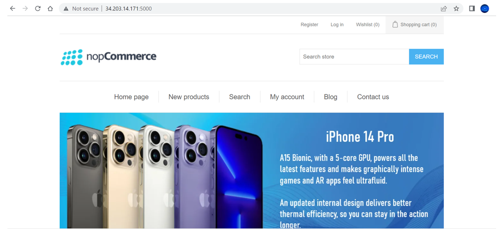

### 6 Create nopcommerce and MySQL server and try to make them work by configuring
* Take t2.midum machine 20.4 ubuntu / install docker via scriptbase

     
### Run command
```bash 
sudo usermod -aG docker ubuntu / exit / and relogin / docker info
```    




* Make a dir ----
```bash
mkdir nop / cd nop / 
sudo apt install docker-compose -y
```



* Run both docker-compose.yaml and dockerfile with only one singne command `docker compose -d `

* the below content paste in   `vi Dockerfile`

```Dockerfile
FROM mcr.microsoft.com/dotnet/sdk:7.0
LABEL author="Anil" organization="qt" project="learning"
ADD https://github.com/nopSolutions/nopCommerce/releases/download/release-4.60.3/nopCommerce_4.60.3_NoSource_linux_x64.zip /nop/nopCommerce_4.60.3.zip
WORKDIR /nop
RUN apt update && apt install unzip -y && \
    unzip /nop/nopCommerce_4.60.3.zip && \
    mkdir /nop/bin && mkdir /nop/logs
EXPOSE 5000
CMD [ "dotnet", "Nop.Web.dll", "--urls", "http://0.0.0.0:5000" ] 
```

* Open `vi docker-compose.yaml` and paste the content


* Run the  command `docker compose -d` 



* then successfully image and container created show the output below command is used

* Now goto web paste there `<public ip>:5000`


